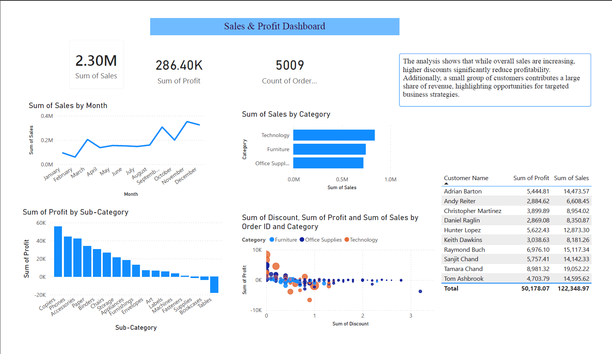

# 📊 Superstore Business Intelligence Project

## 📖 Project Overview
This project analyzes retail sales data to understand business performance, identify profitability issues, and generate actionable insights. The analysis was performed using Python, SQL, and Power BI.

---

## 🛠️ Tools & Technologies
- 🐍 Python (Data Cleaning & Feature Engineering)
- 🗄️ PostgreSQL (Data Querying)
- 📊 Power BI (Dashboard & Visualization)

---

## 🔧 Key Features
✔ Data cleaning and preprocessing  
✔ Feature engineering (Profit Margin, Delivery Days)  
✔ Sales trend analysis  
✔ Top customer identification  
✔ Discount vs Profit analysis  
✔ Interactive dashboard  

---

## 📊 Dashboard Preview


---

## 📈 Key Insights
- 📉 Higher discounts reduce profit  
- 📊 Sales show steady growth over time  
- 🧑‍💼 Top customers contribute major revenue  
- 📦 Some products generate losses  

---

## 🗄️ SQL Analysis
```sql
SELECT Customer_ID, SUM(Profit) AS total_profit
FROM sales
GROUP BY Customer_ID
ORDER BY total_profit DESC
LIMIT 10;
