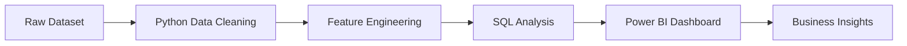

<h1 align="center">🚀 Superstore Business Intelligence Project</h1>

<p align="center">
  
</p>

<p align="center">
  
  
  
  
</p>

---

## 📌 Project Overview

A comprehensive **Business Intelligence project** focused on analyzing retail sales data to derive actionable insights.  
This project simulates a real-world analytics workflow used in industry environments.

---

## 🎯 Objectives

- Evaluate overall business performance  
- Identify sales trends and seasonal patterns  
- Analyze profitability across categories  
- Detect high-value customers  
- Measure the impact of discounts on profit  

---

## 🛠️ Tech Stack

<div align="center">

| Layer            | Tools Used |
|------------------|-----------|
| Data Processing  | Python (Pandas, NumPy) |
| Data Analysis    | PostgreSQL (SQL) |
| Visualization    | Power BI |

</div>

---

## ⚙️ Workflow Pipeline



---

## 🔧 Implementation Details

### 🐍 Data Processing (Python)
- Cleaned and transformed raw dataset  
- Converted date columns into proper format  
- Engineered features:
  - Delivery Days  
  - Profit Margin  
  - Order Year & Month  
- Performed Exploratory Data Analysis  

---

### 🗄️ Data Analysis (SQL)
- Aggregated sales and profit metrics  
- Identified top-performing customers  
- Analyzed category-wise performance  
- Generated business-level insights  

---

### 📊 Dashboard Development (Power BI)
- KPI Cards (Sales, Profit, Orders)  
- Monthly Sales Trend  
- Profit by Sub-Category  
- Discount vs Profit Analysis  
- Top Customers Ranking  
- Interactive Filters (Region, Segment, Category)

---

## 📸 Dashboard Preview

<p align="center">
  
</p>

---

## 📈 Key Insights

- 📉 High discounts significantly reduce profit margins  
- 👥 Top customers contribute a large share of revenue  
- 📊 Technology category shows strong performance  
- ⚠️ Certain sub-categories consistently generate losses  

---

## 💼 Business Impact

- Supports **data-driven decision-making**  
- Helps optimize **pricing and discount strategies**  
- Identifies **high-value customers and products**  
- Improves **overall profitability and efficiency**  

---

## 📁 Project Structure

```
Superstore-Business-Intelligence-Project/
│
├── Data/
├── Python/
├── SQL/
├── Dashboard/
├── README.md
└── supermarket sales prediction.png
```

---

## 💡 Key Contributions

- Designed an end-to-end analytics pipeline  
- Built KPI-driven interactive dashboard  
- Extracted actionable business insights  
- Integrated Python and SQL for efficient analysis  

---

## 📊 GitHub Analytics

<p align="center">
  
  
</p>

---

## 👨‍💻 Author

**Aswini S**

---

<p align="center">
  ⭐ If you found this project valuable, consider giving it a star!
</p>
